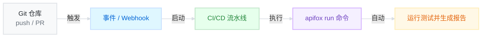

# Git 提交自动触发测试

你可以通过 Git 提交事件（如 push、pull request）自动触发 Apifox 的自动化测试，无需手动干预。这种能力适用于 GitHub Actions、Jenkins、GitLab CI 等任意 CI/CD 平台。


## **核心原理：事件触发 + CLI 命令执行**

Git 提交后自动触发 Apifox 自动化测试，依托于一个通用原理：

无论是通过 Webhook，还是 CI/CD 平台提供的内置事件监听机制<span style="color: #888">（如 GitHub Actions 的 `on: push`）</span>，本质上都是在监听 Git 提交事件，并执行 Apifox 的测试命令。



只要你的 CI/CD 环境能响应 Git 提交，并执行一段命令行脚本，那么就可以集成 Apifox 自动化测试。它一般有两种触发方式：

**1. 平台内置事件机制（如 GitHub Actions、GitLab CI）**

像 GitHub Actions 提供了事件配置语法：

```js
on: [push, pull_request]
```

这类机制不需要配置 Webhook，平台在后台自动监听事件，是更轻便的一种方式。

**2. 外部 Webhook（如 Jenkins、自建服务等）**

如果使用的是 Jenkins、或希望跨平台联动，就需要显式配置 Webhook。


## **常用平台集成示例**

**通过“平台内置事件机制”来触发自动化测试：**

- [与 Github Actions 集成](https://docs.apifox.com/integration-with-github-actions.md) 

- [与 Gitlab 集成](https://docs.apifox.com/integration-with-gitlab.md) 


## **跨平台集成示例：GitHub + Jenkins**


### **场景设定**

* 代码仓库托管在 GitHub
* 流水线执行环境为 Jenkins
* 使用 GitHub Webhook 触发 Jenkins 流水线
* Jenkins 中执行 `apifox run` 命令，运行 Apifox 自动化测试


### **步骤 1：配置 Jenkins 项目**

你可以参考 [与 Jenkins 集成](https://docs.apifox.com/integration-with-jenkins.md) 的文档，创建一个项目并配置好构建命令，确保测试任务可以被执行。

<Background>


</Background>


### **步骤 2：获取 Webhook URL**

Webhook URL 是 Jenkins 用于接收外部请求并触发流水线的入口地址。你可以使用多种方式获得这个 URL，例如通过 Generic Webhook Trigger 等插件。


<Steps>
  <Step>
    在 Jenkins 插件管理中搜索并安装 “Generic Webhook Trigger” 插件，安装完成后重启 Jenkins。

    <Background>

    
    </Background>

  </Step>
  <Step>
    在 Jenkins 的 Dashboard 面板中选中一个项目，进入 Configure 页面，启用 `Generic Webhook Trigger`。此时 Webhook URL 即 `http://<你的 Jenkins 服务地址>/generic-webhook-trigger/invoke`。

 

    <Background>


    </Background>

你也可以自定义一个 Token，这时 Webhook URL 即 `http://<你的 Jenkins 服务地址>/generic-webhook-trigger/invoke?token=<xxxxxx>`：


    <Background>


    </Background>

  </Step>
  <Step>
    点击保存后，将 Webhook URL 复制下来，该地址用于触发 Jenkins 执行测试任务。
  </Step>
</Steps>


### **步骤 3：配置 GitHub Webhook**

进入你的 “GitHub 仓库 → Settings → Webhooks → Add webhook”，配置如下：

* **Payload URL**：`http://<你的 Jenkins 服务地址>/generic-webhook-trigger/invoke?token=<xxxxxx>`
* **Content type**：`application/json`
* **Secret**：可选
* **Which events would you like to trigger this webhook?** 选择`Just the push event`或其他触发事件
* 点击 “Add webhook”

<Background>


</Background>

此时，每次代码 push，GitHub 会自动通过 Webhook 触发 Jenkins 执行你的测试任务。


### **效果验证**


<Steps>
  <Step>
    Push 一次代码到 GitHub 仓库
  </Step>
  <Step>
    Jenkins 会立即开始构建任务
  </Step>
  <Step>
    在 Jenkins 中查看控制台输出和测试结果
  </Step>
</Steps>


<Background>


    
    

</Background>


## **常见平台的 Webhook 配置文档**

- [GitHub Webhooks](https://docs.github.com/en/webhooks)
- [GitLab Webhooks](https://docs.gitlab.com/ce/user/project/integrations/webhooks.html)
- [Bitbucket Cloud](https://support.atlassian.com/bitbucket-cloud/docs/manage-webhooks/)
- [Bitbucket Server](https://confluence.atlassian.com/bitbucketserver/manage-webhooks-938025878.html)
- [Azure Pipelines](https://learn.microsoft.com/en-us/azure/devops/service-hooks/services/webhooks?view=azure-devops)
