# 发布文档站

发布文档站和使用 “快捷分享” 功能是两个不同的概念。“快捷分享” 生成的链接主要用于内部和外部伙伴之间的临时分享，不适合长期使用。

相比之下，“发布文档站” 功能提供了更丰富的自定义选项。你可以自定义域名、页面外观、页面导航等。当你需要把你的接口文档，放在你的官网，面向所有互联网上的读者时，这个功能是最佳选择。

## 发布文档站


<Steps>
  <Step>
<Background>


</Background>
  </Step>
  <Step>
按照下图所示设置环境，这样可以帮助用户更方便地调试你提供的接口。

<Background>


</Background>
  </Step>

</Steps>


## 文档站可见性设置

> Apifox 版本要求 `≥ 2.7.15`

可以根据你的需要，设置文档站的可见性。点击 “立即发布” 按钮即可发布你的文档站，发布之后也可以编辑访问权限。

<Background>


</Background>


<AccordionGroup>
  <Accordion title="公开发布" defaultOpen>
    
意味着所有互联网上的用户，都可以访问你的文档站。你也可以选择将你的文档发布在 [API Hub](https://apifox.com/apihub) 上，让更多的用户发现你的文档站。[API Hub](https://apifox.com/apihub) 是一个由 Apifox 运营的，专门用于分享和探索 API 的开放平台。
   
  </Accordion>
  <Accordion title="密码保护">
    如果你想给你的文档设置密码，只需选择 “密码保护” 选项，然后输入你想要的密码或者随机生成的密码即可。
   
    <Background>

    
    </Background>


  </Accordion>
  <Accordion title="IP 白名单">
    
只有你设置的 “单个 IP 地址和 IP 段” 才可以访问你的文档站。

   
    <Background>

    
    </Background>


  </Accordion>
    <Accordion title="邮箱白名单">
    只有你设置的 “Email” 名单，才可以通过邮箱验证码的方式，访问你的文档站。邮箱白名单支持通配符，方便你对企业邮箱地址的设置。


    <Background>

    
    </Background>

  </Accordion>
    
    <Accordion title="自定义登录页">
当你希望用户访问在线文档站时，先通过你自己的登录系统进行身份验证，可以使用自定义登录功能。

<Steps>
  <Step title="配置说明">
    进入文档可见性设置页面，选择**自定义登录页**，填写以下两项内容：

    * **JWT 密钥**：用于验证 Token 的签名。必须与你的服务端签发 JWT 时使用的密钥保持一致，该密钥需要你自行生成。
    * **登录地址**：用户访问在线文档站时将跳转到此地址。你需要在该地址提供登录页面，并在服务端完成身份验证及 Token 生成。
    
<Background>


</Background>

:::tip[]
这个登录地址不是 Apifox 提供的，而是你自己搭建的登录页面。
:::
  </Step>
  <Step title="认证机制说明">
 JWT（JSON Web Token）是一种开放的用户身份令牌标准。你的登录系统需要完成以下流程：

1. 用户访问你通过 Apifox 发布的在线文档站（例如：`https://xxxxx.apifox.cn`）；

2. 系统自动跳转到你配置的登录页（例如 `http://localhost:3000`）；

3. 用户输入账号密码并提交；

4. 你的服务端验证用户身份；

5. 登录成功后，生成一个使用你设置的 JWT 密钥（如 `pJRdFC3amihQdWbHvUXNZG9WzYdEGHao`）签名的 Token；

6. 然后重定向至文档站地址（例如：`https://xxxxx.apifox.cn`），并通过 `auth_token` 参数将该 Token 附加在 URL 上，例如：
      
```js
https://xxxxx.apifox.cn?auth_token=eyJhbGciOiJI...
```

7. Apifox 自动校验该 Token，验证通过后，用户可继续访问文档内容。


      
登录页工作流程，如下图所示：

```mermaid
graph LR
    A["访问你的在线文档站"]:::start --> B["被重定向到登录页"]:::redirect
    B --> C["填写账号密码"]:::action
    C --> D["验证通过"]:::success
    D --> E["返回携带 JWT 的 URL"]:::token
    E --> F["Apifox 校验 Token"]:::verify
    F --> G{"成功？"}:::decision
    G -->|是| H["成功访问文档"]:::final
    G -->|否| B
    
    classDef start fill:#E1F5FE,stroke:#B3E5FC,color:#01579B;
    classDef redirect fill:#F3E5F5,stroke:#E1BEE7,color:#4A148C;
    classDef action fill:#E8F5E9,stroke:#C8E6C9,color:#1B5E20;
    classDef success fill:#E8F5E9,stroke:#C8E6C9,color:#1B5E20;
    classDef token fill:#FFFDE7,stroke:#FFF9C4,color:#F57F17;
    classDef verify fill#FFEBEE,stroke:#FFCDD2,color:#C62828;
    classDef decision fill#F5F5F5,stroke:#EEEEEE,color:#616161;
    classDef final fill#E0F7FA,stroke:#B2EBF2,color:#006064;
```
      

      
      <Background>


</Background>
  </Step>
    
  <Step title="注意事项">
      
    - JWT 必须由你的服务端生成，签名使用 Apifox 中配置的 JWT 密钥；

    - JWT 会通过 URL 参数 `auth_token` 回传到在线文档站；

    - Apifox 会自动解析并校验 Token；

    - 在线文档站的地址可以是 Apifox 默认发布地址，也可以配置为自定义域名。
      
  </Step>
    


  <Step title="常见问题">

<Accordion title="登录页能使用什么技术栈？" defaultOpen>
没有限制，只要能处理 POST 登录并返回带有 `auth_token` 的 URL 即可。Node.js、PHP、Python、Go 等均可。
</Accordion>


<Accordion title="有示例项目吗？" defaultOpen={false}>
  可以参考 https://github.com/readmeio/readme-custom-login-demo 的例子。
</Accordion>

  </Step>
</Steps>


  </Accordion>

</AccordionGroup>

## 发布范围

默认情况下，文档发布范围包括所有 “已共享” 的资源。你可以在 “接口管理” 中配置这个选项。详情请参考[文档可见性设置](https://docs.apifox.com/documentation-visibility-settings.md)。

<Background>
 

</Background>


## 发布多版本的文档站

要发布多个 API 版本的文档，使用 “API 版本” 功能。详情请查看 [API 版本](https://docs.apifox.com/api-version.md)。


## 发布多个文档站

当你希望将文档发布到不同渠道，同时又希望在同一项目中进行维护时，可以在发布文档时新建文档站点。为了方便管理，你可以复制主站点的配置项来创建新站点。每个子站点都可以设置不同的自定义域名。

<Background>


</Background>

只有子站点允许设置发布文档的可见范围，让你可以选择哪些资源可以公开访问。

<Background>


</Background>

## 永久链接

- **Apifox 提供的域名**：你的文档会有一个默认的 Apifox 子域名，比如 `ykr5x1s46r.apifox.cn`，你可以手动修改它。所有 Apifox 文档都使用 `apifox.cn` 域名。

- **自定义域名**：你可以把 Apifox 文档绑定到自己的域名。了解更多关于 [自定义域名](https://docs.apifox.com/custom-domain.md) 的信息。

- **文档重定向规则**：你可以设置重定向规则，在 URL 变更时自动把用户引导到正确的文档，避免链接失效，保证用户体验。

<Background>


</Background>

## 其他设置

- **文档搜索**：已发布的 API 文档默认包含内置搜索功能，Apifox 还提供了 Algolia 集成来增强搜索能力。了解更多关于 [文档搜索](https://docs.apifox.com/documentation-site-search-settings.md) 的信息。
- **发布到 API Hub**：你可以选择把文档发布到 [API Hub](https://api.com/apihub)，这是 Apifox 运营的一个专门用于分享和探索 API 的开放平台。
- **允许导出、克隆数据**：你可以导出主分支中已发布的文档数据。

<Background>


</Background>

## 个性化设置

<Background>


</Background>

在 “个性化设置” 中，你可以设置 API 文档的各种基本选项，包括：

- 标题
- Logo
- 网站图标
- 描述
- 主题色
- 语言
- 明/暗模式
- ......


你可以在这里实时预览你的文档，效果满意后再点击保存。

<Background>


</Background>


## 文档内容显示

在 “个性化设置” 中，你还可以自定义在 API 文档中显示哪些字段，包括：

- 前置 URL
- 示例代码
- 责任人
- 接口文档最后修改时间
- OperationId
- 数据模型
- 隐藏 "Run in Apifox"
- 展示 "调试" 按钮
- 允许 "导出"、"克隆" 数据
- ......

<Background>


</Background>


## 页面布局

你可以轻松自定义页面布局。了解更多关于 [页面布局](https://docs.apifox.com/page-layout-settings.md) 的信息。


<Background>


</Background>

## 自定义首页

你可以自定义你的在线文档首页，可以使用 Markdown 或带有 CSS 和 JavaScript 的 HTML。
<Background>


</Background>

## 自定义 CSS、JavaScript、HTML

可以设置全局的 CSS、JavaScript 和页脚的 HTML，详见 [自定义页面代码](https://docs.apifox.com/custom-css-js-html) 文档
<Background>


</Background>

